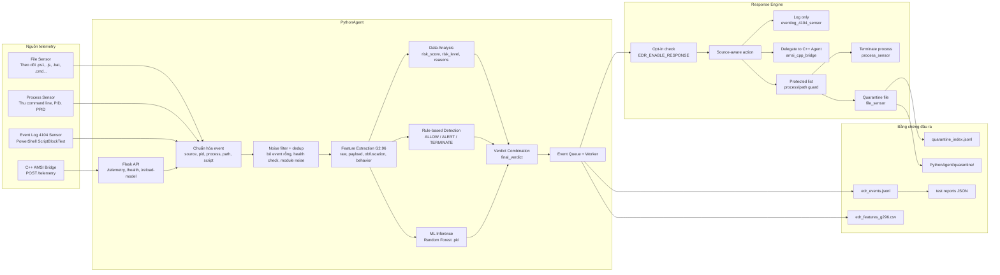
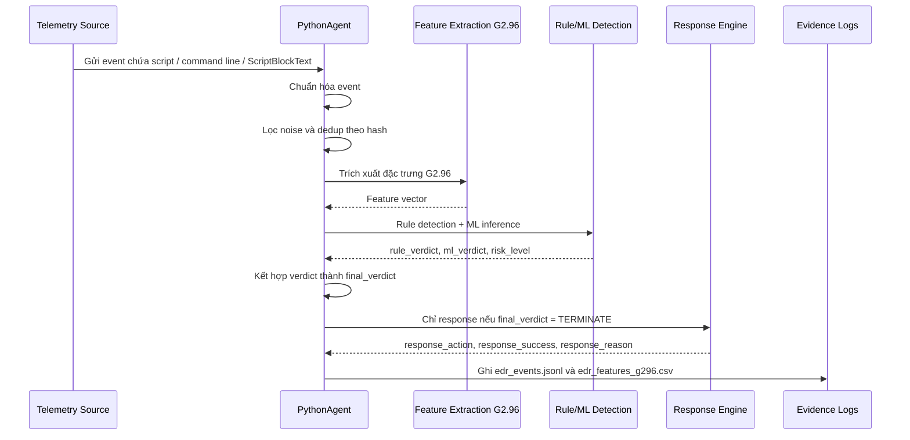

# Sơ đồ kiến trúc tổng quan PythonAgent

Tài liệu này dùng để trực quan hóa kiến trúc hiện tại của `PythonAgent` trong hệ thống Mini EDR PowerShell. Sơ đồ tập trung vào luồng chính: thu thập telemetry, chuẩn hóa dữ liệu, trích xuất đặc trưng, phát hiện, response và ghi log bằng chứng.

## 1. Sơ đồ tổng quan



## 2. Pipeline xử lý một event



## 3. Vai trò các khối chính

| Khối | Vai trò |
|---|---|
| File Sensor | Theo dõi file script trong Desktop, Downloads, Documents và OneDrive tương ứng |
| Process Sensor | Ghi nhận process mới, command line, PID, PPID và parent process |
| Event Log 4104 Sensor | Đọc PowerShell Script Block Logging từ Windows Event Log |
| C++ AMSI Bridge | Gửi nội dung script runtime từ AMSI sang PythonAgent qua HTTP |
| Feature Extraction G2.96 | Chuyển script/command thành vector đặc trưng hành vi |
| Rule Detection | Phát hiện nhanh các indicator như EncodedCommand, IEX, downloader, bypass, Defender tampering |
| ML Inference | Dự đoán `BENIGN`, `SUSPICIOUS` hoặc `MALICIOUS` nếu model được load |
| Verdict Combination | Kết hợp C++ verdict, rule verdict, ML verdict và risk level |
| Response Engine | Response opt-in, chỉ xử lý `TERMINATE`, phân biệt hành động theo source |
| Evidence Logs | Lưu event, feature, response action và report phục vụ thực nghiệm |

## 4. Gợi ý chèn vào báo cáo

Tên hình đề xuất:

```text
Hình 3.x. Kiến trúc tổng quan của PythonAgent trong hệ thống Mini EDR PowerShell
```

Chú thích ngắn:

```text
PythonAgent đóng vai trò trung tâm phân tích, nhận telemetry từ File Sensor, Process Sensor, Event Log 4104 Sensor và C++ AMSI Bridge. Dữ liệu được chuẩn hóa, trích xuất đặc trưng G2.96, phân loại bằng rule-based detection và Machine Learning, sau đó đưa ra final verdict và ghi log bằng chứng. Response Engine chỉ hoạt động khi được bật và chỉ xử lý các event có verdict TERMINATE.
```

