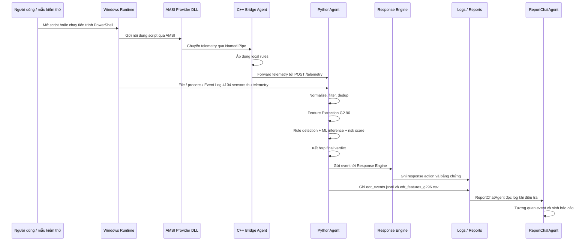

# Sơ đồ kiến trúc tổng quan hệ thống Mini EDR PowerShell

Tài liệu này mô tả kiến trúc tổng quan của toàn bộ hệ thống Mini EDR PowerShell, bao gồm các thành phần C++ AMSI Provider, C++ Native Bridge Agent, PythonAgent, hệ thống log/report và ReportChatAgent.

## 1. Sơ đồ kiến trúc tổng quan

```mermaid
flowchart LR
    subgraph WIN["Máy Windows / Endpoint Lab"]
        USER["Người dùng / Mẫu kiểm thử<br/>PowerShell, JS, BAT, CMD, EXE"]
        PS["PowerShell Runtime"]
        FSYS["File System<br/>Desktop, Downloads, Documents"]
        PROC["Process Table<br/>PID, PPID, command line"]
        EVT["Windows Event Log<br/>PowerShell Operational / 4104"]
        AMSIAPI["Windows AMSI Interface"]
    end

    subgraph NATIVE["Native C++ Layer"]
        PROVIDER["AmsiProvider.dll<br/>Custom AMSI Provider"]
        PIPE["Named Pipe<br/>\\\\.\\pipe\\EdrAmsiPipe"]
        CPP["AgentConsole.exe<br/>C++ Native Bridge Agent"]
        CPPRULE["C++ Local Rules<br/>AMSI quick verdict"]
        CPPLOG["edr_cpp_agent.log"]
    end

    subgraph PY["PythonAgent"]
        API["Flask API<br/>/telemetry, /health, /reload-model"]
        FILES["File Sensor"]
        PROCS["Process Sensor"]
        EV4104["Event Log 4104 Sensor"]
        NORMAL["Normalize + Queue"]
        FEATURE["Feature Extraction G2.96"]
        DETECT["Detection Engine<br/>Rule + ML + Risk Score"]
        VERDICT["Verdict Combination<br/>ALLOW / ALERT / TERMINATE"]
        RESPONSE["Response Engine<br/>opt-in, source-aware"]
    end

    subgraph MODEL["Model & Config"]
        RF["random_forest_model.pkl"]
        COLS["feature_columns.pkl"]
        ENV["Runtime config<br/>EDR_ENABLE_RESPONSE, EDR_WATCH_PATHS"]
    end

    subgraph OUTPUT["Evidence / Output"]
        EVENTS["edr_events.jsonl"]
        FEATURES["edr_features_g296.csv"]
        QINDEX["quarantine_index.jsonl"]
        QDIR["PythonAgent/quarantine/"]
        TESTS["Test reports JSON<br/>sensor, ML, Atomic, response, AMSI"]
    end

    subgraph REPORT["ReportChatAgent"]
        RLOAD["Load EDR logs"]
        RCORR["Correlate events<br/>PID, hash, source, time"]
        RLLM["DeepSeek / LLM<br/>Generate investigation report"]
    end

    USER --> PS
    USER --> FSYS
    USER --> PROC
    PS --> EVT
    PS --> AMSIAPI

    AMSIAPI --> PROVIDER
    PROVIDER --> PIPE
    PIPE --> CPP
    CPP --> CPPRULE
    CPPRULE --> CPPLOG
    CPP --> API

    FSYS --> FILES
    PROC --> PROCS
    EVT --> EV4104
    API --> NORMAL
    FILES --> NORMAL
    PROCS --> NORMAL
    EV4104 --> NORMAL

    NORMAL --> FEATURE
    FEATURE --> DETECT
    RF --> DETECT
    COLS --> DETECT
    ENV --> RESPONSE
    DETECT --> VERDICT
    VERDICT --> RESPONSE

    RESPONSE --> EVENTS
    FEATURE --> FEATURES
    RESPONSE --> QINDEX
    RESPONSE --> QDIR
    EVENTS --> TESTS

    CPPLOG --> RLOAD
    EVENTS --> RLOAD
    RLOAD --> RCORR
    RCORR --> RLLM
```



## 2. Luồng xử lý chính của hệ thống



## 3. Vai trò từng thành phần

| Thành phần | Vai trò |
|---|---|
| `AmsiProvider.dll` | Custom AMSI Provider, nhận nội dung script từ Windows AMSI |
| `AgentConsole.exe` | C++ Native Bridge Agent, nhận telemetry từ AMSI Provider qua Named Pipe, áp dụng local rule và forward sang PythonAgent |
| `PythonAgent` | Trung tâm phân tích, nhận telemetry đa nguồn, trích xuất đặc trưng, phát hiện, ML inference và response |
| File Sensor | Theo dõi script file trong các thư mục người dùng |
| Process Sensor | Theo dõi tiến trình mới và command line đáng nghi |
| Event Log 4104 Sensor | Đọc PowerShell Script Block Logging |
| Feature Extraction G2.96 | Chuyển script/command thành vector đặc trưng hành vi |
| Rule Detection | Phát hiện các indicator rõ ràng như IEX, EncodedCommand, downloader, Defender tampering |
| ML Model | Phân loại hành vi dựa trên Random Forest nếu model được load |
| Response Engine | Response opt-in, chỉ xử lý `TERMINATE`, có protected list và quarantine |
| Evidence Logs | Lưu event, feature, response action và report thực nghiệm |
| ReportChatAgent | Đọc log, tương quan event và sinh báo cáo điều tra bằng LLM |

## 4. Các điểm nhấn kiến trúc

- Hệ thống dùng kiến trúc đa sensor để tránh phụ thuộc vào một nguồn telemetry duy nhất.
- C++ AMSI Bridge giúp quan sát script gần thời điểm thực thi.
- PythonAgent hợp nhất telemetry từ AMSI, file, process và Event Log 4104.
- Detection kết hợp rule-based baseline, risk score và Machine Learning.
- Response được thiết kế theo hướng opt-in để an toàn trong môi trường lab.
- Log và report JSON được dùng làm bằng chứng thực nghiệm cho khóa luận.

## 5. Gợi ý chèn vào báo cáo

Tên hình đề xuất:

```text
Hình 3.x. Kiến trúc tổng quan hệ thống Mini EDR PowerShell
```

Chú thích ngắn:

```text
Hệ thống Mini EDR PowerShell gồm lớp Native C++ để tích hợp AMSI, PythonAgent để thu thập và phân tích telemetry đa nguồn, Response Engine để xử lý các verdict nguy hiểm và ReportChatAgent để hỗ trợ điều tra từ log. Kiến trúc đa sensor giúp hệ thống quan sát được hành vi PowerShell ở nhiều tầng gồm file, process, Event Log 4104 và AMSI runtime.
```

