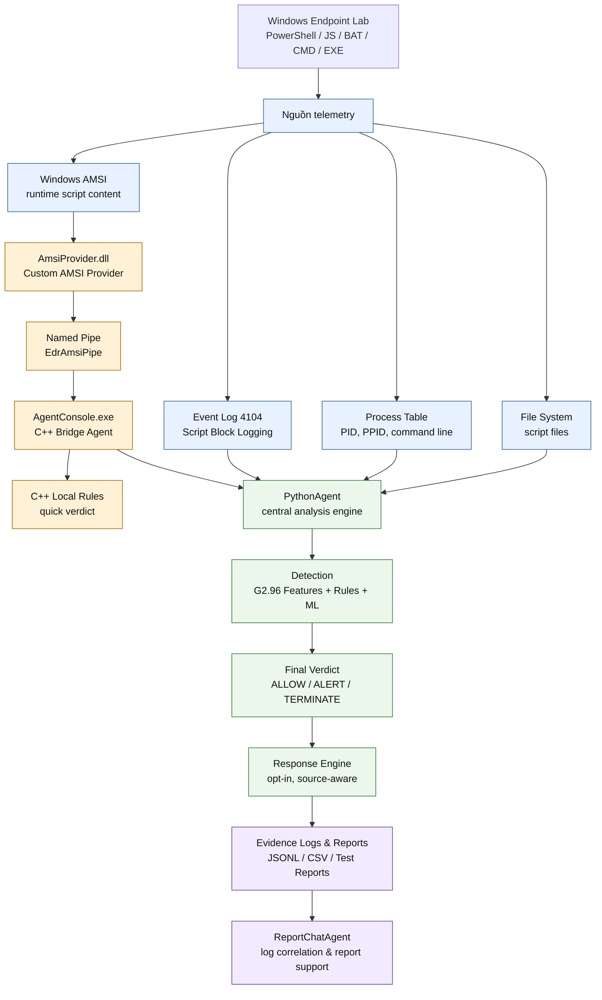
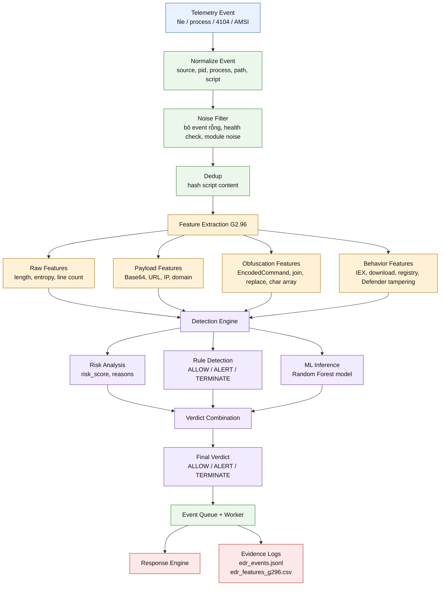
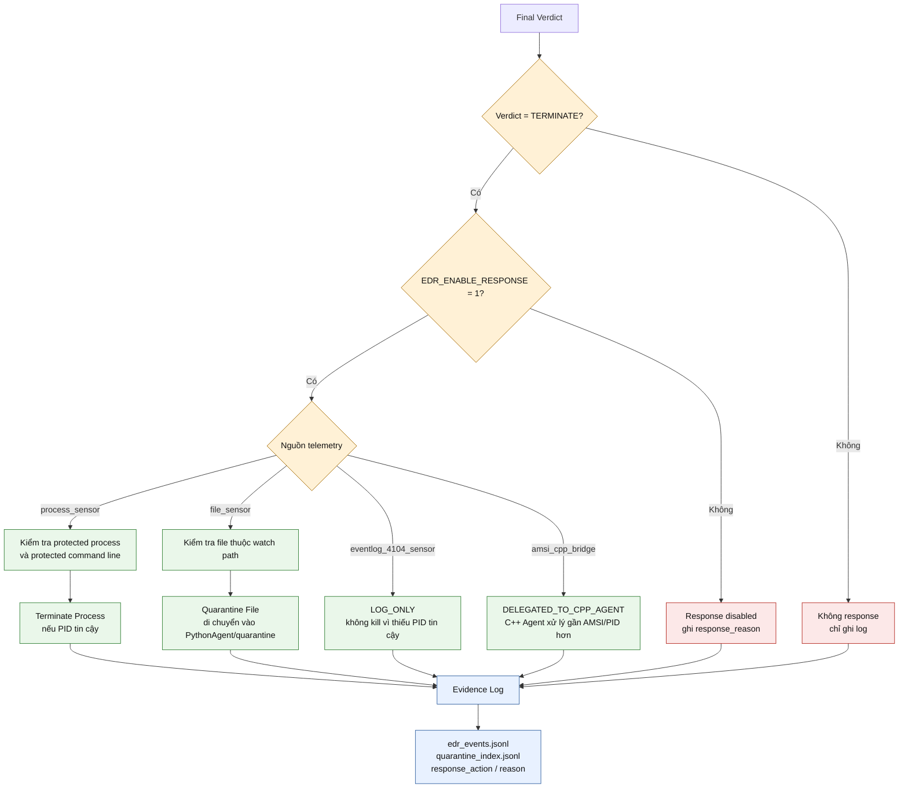

# Mermaid cho phần kiến trúc và pipeline trong báo cáo Word

Tài liệu này chứa các sơ đồ Mermaid đã được tối ưu để chèn vào Word theo bố cục dọc. Thay vì dùng một sơ đồ quá lớn, phần kiến trúc nên chia thành 3 hình nhỏ:

1. Kiến trúc tổng quan hệ thống.
2. Pipeline xử lý trong PythonAgent.
3. Cơ chế response theo nguồn telemetry.

Cách trình bày này giúp giáo viên hướng dẫn nắm hệ thống theo từng lớp: hệ thống nhận dữ liệu từ đâu, PythonAgent xử lý như thế nào, và response được quyết định ra sao.

## Hình 1. Kiến trúc tổng quan hệ thống Mini EDR PowerShell



**Cách giải thích với giáo viên hướng dẫn:**

Sơ đồ này mô tả toàn bộ hệ thống theo 4 lớp. Lớp đầu tiên là endpoint Windows, nơi phát sinh hành vi PowerShell hoặc script. Lớp thứ hai là các nguồn telemetry gồm file, process, Event Log 4104 và AMSI. Lớp thứ ba là PythonAgent, đóng vai trò trung tâm phân tích và kết hợp rule, ML, risk score. Lớp cuối cùng là response, log bằng chứng và ReportChatAgent hỗ trợ điều tra.

**Chú thích hình đề xuất:**

```text
Hình x. Kiến trúc tổng quan hệ thống Mini EDR PowerShell.
```

## Hình 2. Pipeline xử lý telemetry trong PythonAgent



**Cách giải thích với giáo viên hướng dẫn:**

Sơ đồ này tập trung vào bên trong PythonAgent. Mọi telemetry từ các sensor đều được chuẩn hóa về cùng định dạng, sau đó lọc nhiễu và chống trùng lặp. Nội dung script hoặc command line được trích xuất đặc trưng G2.96. Detection Engine kết hợp ba nguồn quyết định: risk analysis, rule-based detection và Machine Learning. Cuối cùng agent tạo final verdict và ghi log bằng chứng.

**Chú thích hình đề xuất:**

```text
Hình x. Pipeline xử lý telemetry trong PythonAgent.
```

## Hình 3. Response theo nguồn telemetry



**Cách giải thích với giáo viên hướng dẫn:**

Sơ đồ này giải thích vì sao response của hệ thống không xử lý giống nhau cho mọi event. Agent chỉ response khi verdict là `TERMINATE` và biến môi trường `EDR_ENABLE_RESPONSE` được bật. Với `process_sensor`, agent có thể terminate process nếu PID tin cậy. Với `file_sensor`, agent quarantine file nếu file nằm trong watch path. Với `eventlog_4104_sensor`, agent chỉ log vì Event Log 4104 không cung cấp PID đủ tin cậy. Với `amsi_cpp_bridge`, response được giao cho C++ Agent vì thành phần này gần tầng AMSI và PID runtime hơn.

**Chú thích hình đề xuất:**

```text
Hình x. Cơ chế response theo nguồn telemetry trong PythonAgent.
```

## Cách xuất sơ đồ để chèn vào Word

Có thể dùng một trong các cách sau:

1. Mở file `.md` bằng VS Code có hỗ trợ Mermaid Preview.
2. Copy từng block Mermaid vào Mermaid Live Editor.
3. Export hình ở định dạng `SVG` hoặc `PNG`.
4. Chèn hình vào Word bằng `Insert -> Pictures`.
5. Đặt caption theo mẫu:

```text
Hình x. Tên sơ đồ
Nguồn: Nhóm thực hiện
```

Gợi ý khi chèn vào Word:

- Dùng sơ đồ dọc để phù hợp trang A4 portrait.
- Nếu sơ đồ vẫn dài, đặt mỗi sơ đồ ở một trang riêng.
- Nên dùng `SVG` nếu Word hỗ trợ để hình không bị vỡ.
- Nếu dùng `PNG`, nên export ở độ phân giải cao.
- Không cần đưa toàn bộ chi tiết code vào hình, chỉ giữ các khối chính để giáo viên nắm nhanh kiến trúc.

